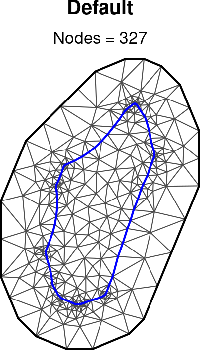
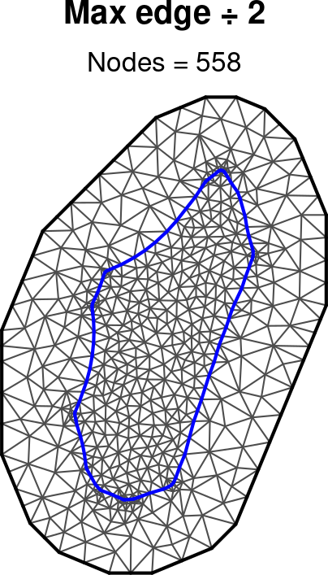
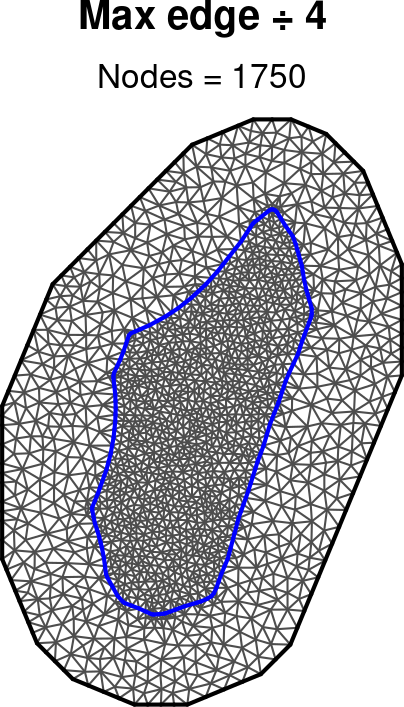
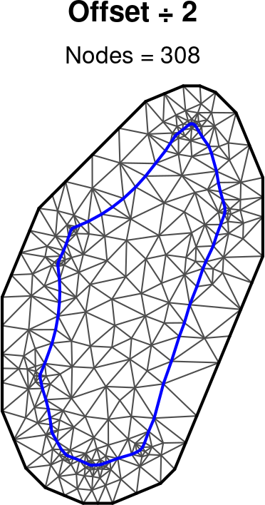
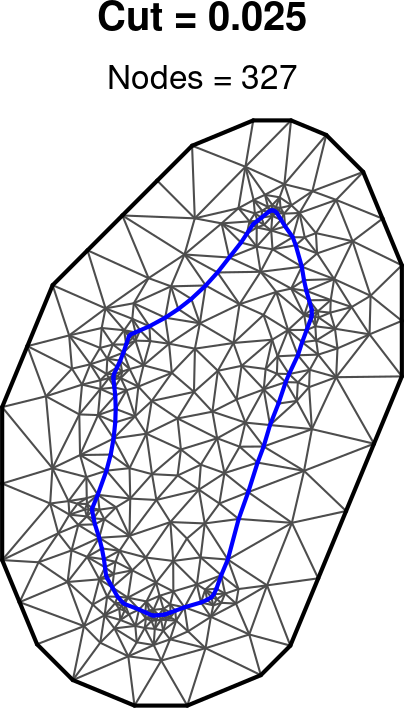
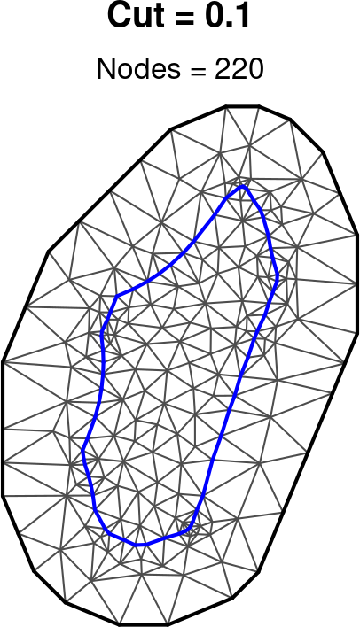
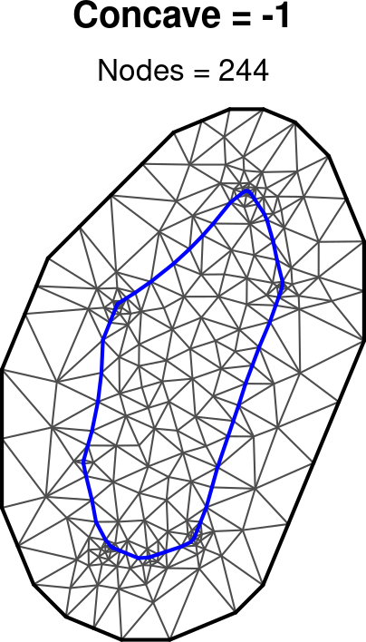
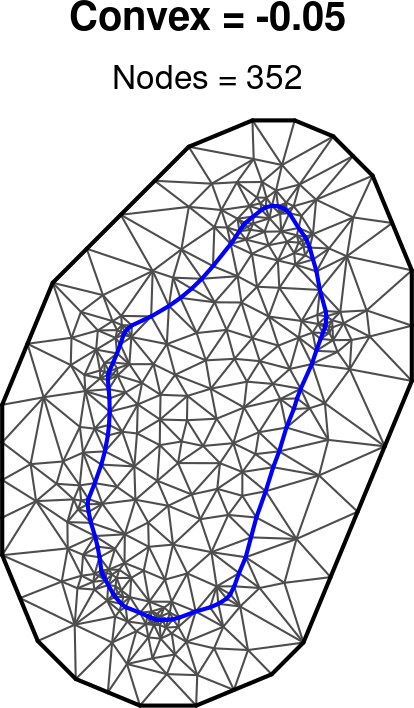
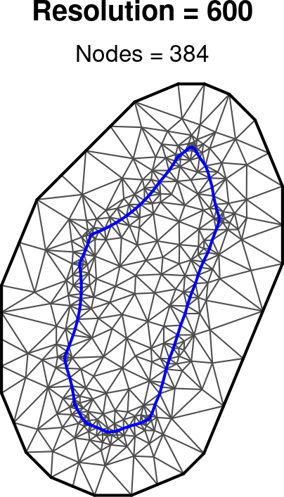

### **Module: Prepare mesh**

**BACKGROUND**

This module prepares a spatial mesh which is required to simplify the model fitting process. Instead of modelling the process across an infinite space, the mesh is used to model across the space in discrete locations (nodes) and results in between these nodes can be interpolated from the output. In order to avoid edge effects it is necessary to extend the mesh outside of the area of interest. The number of nodes affects the time required to fit the model and a mesh with 200-300 nodes is sufficient to fit an initial model. The default settings are adjusted depending on the area of interest and for an initial model are typically suitable, but you may wish to increase the number of nodes to 2000-3000 for final model runs. 

**IMPLEMENTATION**

The module calls `disaggregation::build_mesh()` which in turn calls `fmesher::fm_nonconvex_hull_inla()` to generate the outer mesh and `fmesher::fm_mesh_2d()` to generate the whole mesh.

There are two sets of parameters that affect the mesh inside and outside of the area of interest. In most cases the boundary parameters (convex, concave and resolution) do not need altering, but if you wish to modify them, toggle the "Change boundary parameters" switch.

You can generate multiple meshes using different parameters and these will all be visible in the Results panel. You can select which one to use in the model in the model in the "Selected mesh" dropdown menu.

To increase the number of nodes, decrease the *Max edge* parameter which controls the maximum distance between nodes:

  
   
  

  
   
  

Boundary parameters:

  
   
  

**REFERENCES**

references
